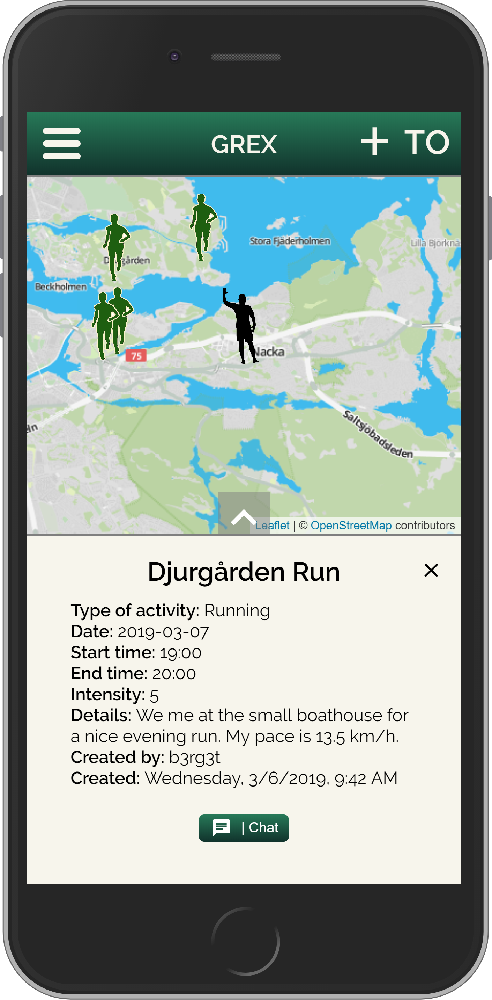

Welcome to Grex!

Are you tired of working out alone and want a training partner?

Look no further!

Grex is where you can partner up with a workout buddy. Whether it's for a run, a swim or just to walk your dog - it's your choice. You can easily find activities and add your own, and to join one you're interested in all you have to do is to send them a message in the chat.

---

    

---

Project status:
- A user can sign in or sign up with email, username and password.
- Users can create their own profile.
- Users can edit their profile and change password.
- It´s running with https://leafletjs.com/ map.
- There is a realtime location marker of the signed in user on the map.
- A signed in user can create an activity depending on what kind of exercise a user want to do and put a marker on the map where the user want to do the exersice.
- The markers from any activity can be seen by every signed in user on the map.
- There is a list that displays all activities created. To se more information about any activity the user press either the popup that displays when click on a marker on the map or by clicking any activity in the activitylist.
- A user can join a activity by enter the chat created in every activity where you can chat with everyone interested in the activity.
- Users can click on any username of any member in the chat to see their profile.
- There is an admin view where you can do a password reset for normal users.

Upcoming update:
- Filter function for activities view.
- Search function to search for specific activity.
- Rating system of users and activities.
- Statistic about users and activities.
- User will be able to upload its own profile picture.
- Choose distance to activities on the map.
- Improved edit profile.
- A regular user can chat with an admin.

---

Installation

Starting the application

1. Clone this repo
2. Run npm install
3. Followed by npm start - to get the app up and running.

Firebase

As for back-end we have been using Firebase.
You’ll need a Firebase API-key of your own to be able to get the app working. If you haven’t registered over att https://firebase.google.com/ please do.

When registered you’ll then need to create your environment variable files

- .env.development

  REACT_APP_API_KEY=**Your API Key**
  
  REACT_APP_AUTH_DOMAIN=grex-candy.firebaseapp.com.firebaseapp.com
  
  REACT_APP_DATABASE_URL=https://grex-candy.firebaseio.com
  
  REACT_APP_PROJECT_ID=grex-candy
  
  REACT_APP_STORAGE_BUCKET=grex-candy.appspot.com
  
  REACT_APP_MESSAGING_SENDER_ID=1039217284402
  

* .env.production (Not critical)

  REACT_APP_API_KEY= **Your API Key**

  REACT_APP_AUTH_DOMAIN=grex-candy.firebaseapp.com.firebaseapp.com

  REACT_APP_DATABASE_URL=https://grex-candy.firebaseio.com

  REACT_APP_PROJECT_ID=grex-candy

  REACT_APP_STORAGE_BUCKET=grex-candy.appspot.com

  REACT_APP_MESSAGING_SENDER_ID=1039217284402

  REACT_APP_CONFIRMATION_EMAIL_REDIRECT=https://mydomain.com

---

# grex_candy

David Berg,
Gustav Lindberg,
Anders Wik Rydberg,
Tina Olsson
